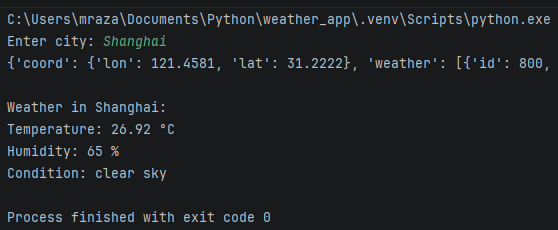
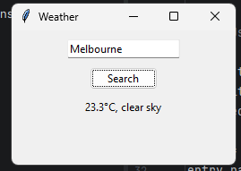

# Weather App

A simple desktop weather application I built with python, tkinter and the OpenWeatherMap API. I also made a CLI version first.

---

## Preview

### CLI


### GUI


---

## Features

- Search weather by city name
- Displays current temperature in Celsius (°C)
- Displays current conditions
- Added humidity indicator in GUI
---

## Technologies Used

- Python 
- Tkinter
- Requests library
- OpenWeatherMap API

---

## How to run

```bash
python weather_app.py
